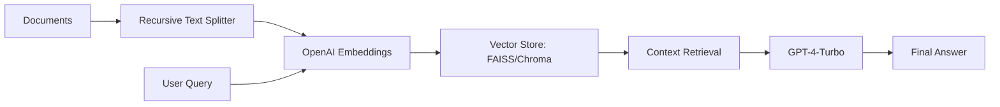

# Advanced GenAI PEFT & RAG Laboratory

An enterprise-grade research and production-ready repository for advanced Large Language Model (LLM) workflows. This laboratory focuses on Parameter-Efficient Fine-Tuning (PEFT), Retrieval-Augmented Generation (RAG), and Agentic Tool-Use architectures.

## 🚀 Overview

This repository provides modular, production-ready abstractions for:
1.  **PEFT/LoRA Fine-tuning:** Efficient adaptation of foundation models (Mistral, Llama-2) using QLoRA.
2.  **Modular RAG Engine:** Semantic search and context retrieval using LangChain, OpenAI, and Vector DBs (FAISS/Chroma).
3.  **Agentic Tool-Use:** Multi-step reasoning agents capable of calling external tools (Search, Calculators, etc.).
4.  **Interactive Dashboard:** A Streamlit-based UI for real-time experimentation.

---

## 🏗️ Architecture

### 1. RAG Workflow (Semantic Search)


### 2. PEFT/LoRA Architecture
LoRA freezes the pre-trained model weights and injects trainable rank decomposition matrices into each layer of the Transformer architecture, greatly reducing the number of trainable parameters.

```mermaid
graph TD
    Input[Input] --> W[Pre-trained Weights (Frozen)]
    Input --> A[Matrix A (Trainable)]
    A --> B[Matrix B (Trainable)]
    W --> Out[Output]
    B --> Out
```

---

## 📂 Project Structure

```text
Advanced-GenAI-PEFT-Lab/
├── app/
│   └── streamlit_ui.py      # Main UI dashboard
├── core/
│   ├── agents/
│   │   └── agent_manager.py  # LangChain Agent orchestration
│   ├── finetuning/
│   │   └── lora_trainer.py   # LoRA/QLoRA training logic
│   └── rag/
│       └── rag_engine.py     # RAG & Vector DB integration
├── .gitignore               # Standard Python/Model ignore
├── requirements.txt         # Production dependencies
└── README.md                # Project documentation
```

---

## 🛠️ Installation & Setup

1. **Clone the repository:**
   ```bash
   git clone https://github.com/your-repo/Advanced-GenAI-PEFT-Lab.git
   cd Advanced-GenAI-PEFT-Lab
   ```

2. **Install dependencies:**
   ```bash
   pip install -r requirements.txt
   ```

3. **Configure Environment:**
   Create a `.env` file in the root directory:
   ```env
   OPENAI_API_KEY=your_key_here
   ```

4. **Launch the Lab:**
   ```bash
   streamlit run app/streamlit_ui.py
   ```

---

## 🧪 Core Components

### PEFT/LoRA Training
Uses `peft` and `bitsandbytes` for 4-bit quantization (QLoRA). Configurable rank `r` and `alpha` through Pydantic models.

### RAG Engine
Implements `RecursiveCharacterTextSplitter` for optimal chunking and uses `FAISS` for high-performance CPU-based vector search.

### Agentic Manager
Uses OpenAI Functions agents to provide a structured way for LLMs to interact with external APIs and tools, maintaining a conversation history for multi-turn reasoning.

---

## ⚖️ License

Distributed under the MIT License. See `LICENSE` for more information.

---

**Author:** Senior GenAI Engineer / Architect
